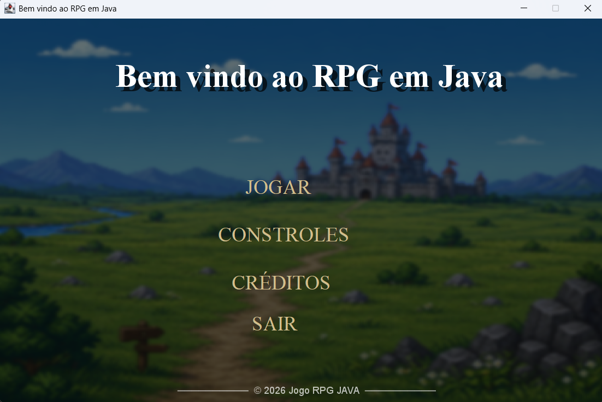
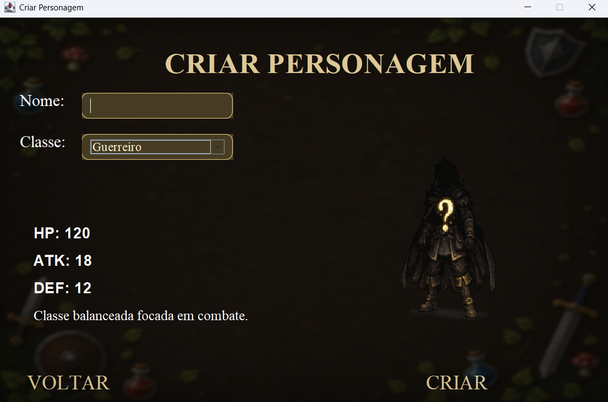
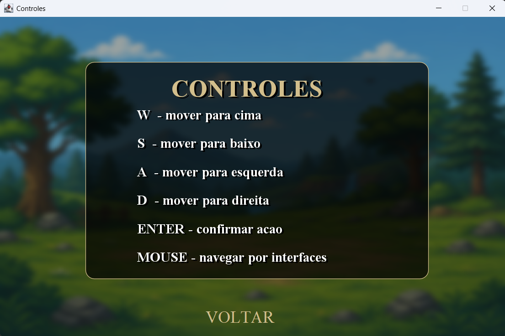
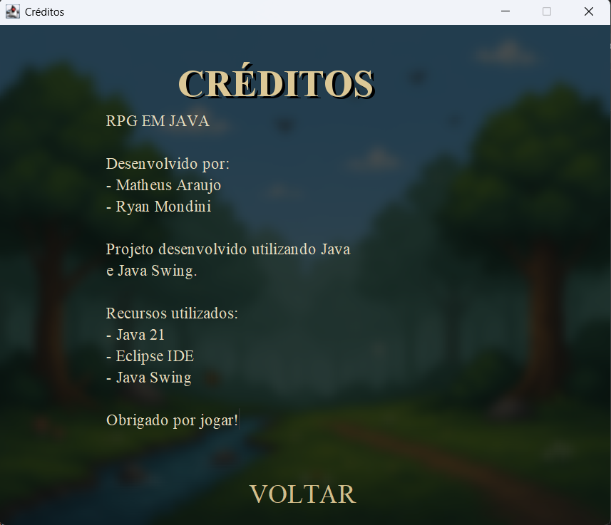
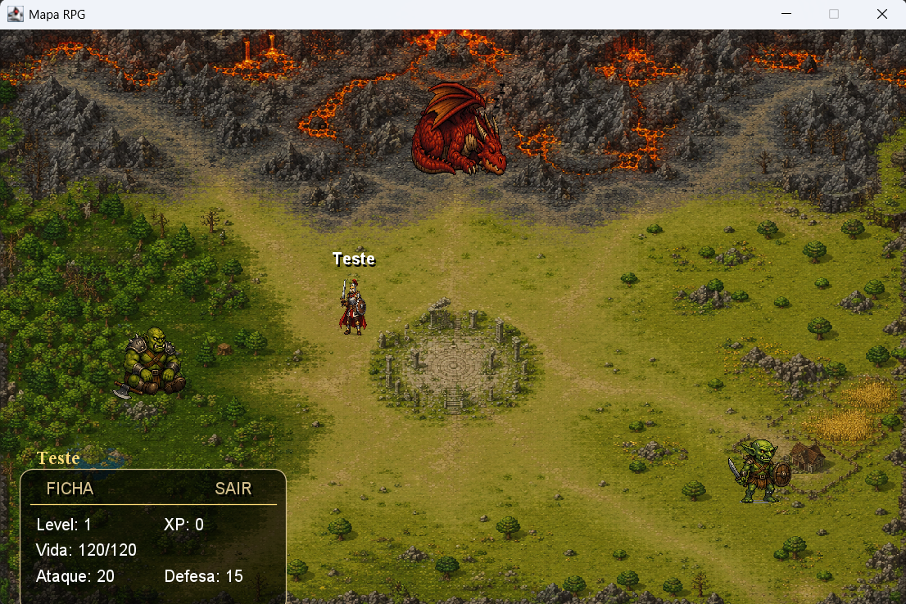
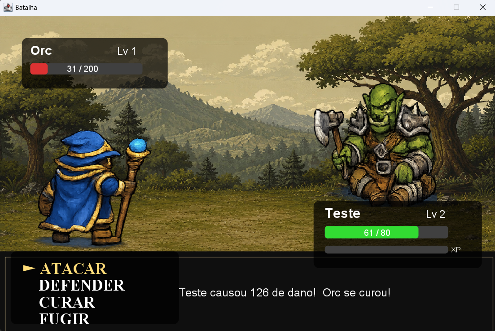

## Jogo básico de RPG em Java

Este projeto tem como base explorar os conceitos de Programação Orientada a Objeto,
buscando estudar classes, heranças, plimorfismo, encapsulamento entre outros tópicos presente
a em programação orientaça a objeto. O jogo consiste em batalhar com npc's através de um modelo
muito famoso em diversos jogos de RPG, que é o RPG em turnos, ou seja, cada ação do jogador ou do npc
é realizada em um turno.

## Tecnologias utilizadas
- Java 21
- Java Swing

## Funcionalidades
O projeto consiste em um jogo de fácil compreensão, podendo:
- Criar personagens,
- Selecionar classes do jogador:
  - Guerreiro,
  - Mago,
  - Arqueiro.
- Subir de nivéis e ficar mais fortes,
- Lutar com três inimigos diferentes, com atribuitos distintos entre si:
  - Goblin (Nível fácil),
  - Orc (Nível médio),
  - Dragão (Nível Difícil),

Além disso o jogo possui um sistema de movimentação através de um mapa, onde pode-se
chegar aos inimigos citados, uma pequena HUD com suas informações, como nome, nível, experiencia,
vida, ataque, defesa e opções de "Ficha', que exibe todos os atributos do personagem, e "Sair" que volta para a tela inicial.
Já na tela de menu, temos a opção de "Jogar", onde o jogador é direcinado a uma tela de criação de personagem, e lgoa depois o jogo começa,
têm-se também uma opção de controles, onde há um pequeno texto que ensina como jogar,
inclui-se também uma opção de créditos, visto que lá encontran-se os criadores e os recursos utilizados,
por fim têm-se a opção de sair que ao ser selecionado ela fecha o jogo.
Vale ressaltar que o jogo possui duas trilhas sonoras que são tocadas de forma aleatória ao iniciar o jogo, visto que a música é
somente interrompida quando o jogo é fechado, pois ela toca em loop.
Portanto, esse é um projeto bem simples, desenvolvido para aprender na prática uma nova linguagem de programação, no caso Java,
e entrar em contato com um novo paradigma programação, a orientação a objeto.

## Obejtivo
Esta atividade tem como objetivo, desenvolver lógica e estrutura de programação, como citado anteriormente utilizando o paradigma
de programação orientada a objeto, visando explorar os tópicos presente em tal estrutura, ao disernimento de subclasses e superclasse,
atributos e métodos protegidos, uso de getters e setters, uso de uma interface gráfica, que no projeto foi utilizado o java swing, dado que
dentro das interfaces principalmente no mapa utilizou-se bastante o conceito de colisão entre objetos pertencentes aquele mapa, e também houve uma pequena animação
no movimento do personagem ao se delocar pelo mapa. Tudo isso teve o propósito de criar um jogo interativo para o usuario.

## Demonstração

Menu

Criação de personagem

Controles

Créditos

Mapa

Gameplay

