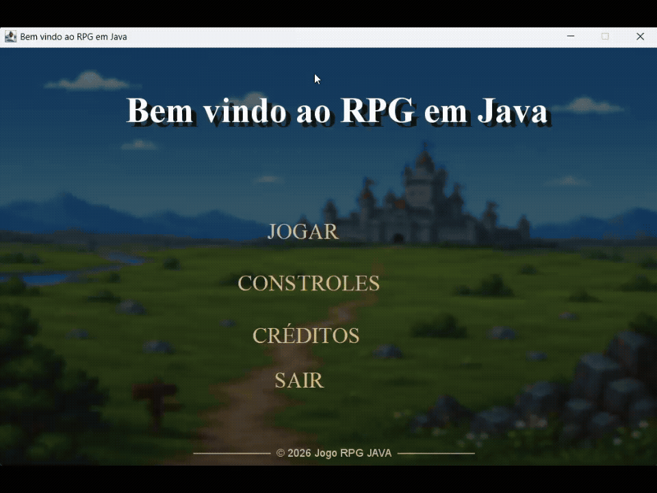

# Jogo RPG em Java

Um jogo de RPG 2D desenvolvido em Java utilizando Programação Orientada a Objetos e Java Swing.
O jogador pode criar seu personagem, escolher uma classe, explorar um mapa, encontrar inimigos e participar de batalhas por turnos.
O projeto foi desenvolvido com o objetivo de praticar conceitos de Programação Orientada a Objetos, como:

- Classes e objetos;
- Encapsulamento;
- Herança;
- Polimorfismo;
- Métodos e atributos;
- Interfaces gráficas;
- Eventos de teclado e mouse;
- Colisões entre objetos;
- Animações e timers.

## Demonstração



## Tecnologias utilizadas

- Java 21;
- Java Swing;
- Programação Orientada a Objetos;
- Java AWT;
- Eventos de teclado e mouse;
- Graphics2D;
- Timer do Swing.

## Funcionalidades

### Personagem

- Criação de personagem;
- Escolha entre três classes:
  - Guerreiro;
  - Mago;
  - Arqueiro.
- Sistema de nível;
- Sistema de experiência;
- Atributos de ataque e defesa;
- Sistema de vida;
- Sistema de cura.

### Exploração

- Movimentação pelo mapa utilizando WASD;
- Animação de movimento;
- Sistema de colisão;
- Inimigos espalhados pelo mapa;
- HUD com informações do personagem.

### Batalha

- Sistema de batalha por turnos;
- Ataque;
- Defesa;
- Cura;
- Fuga;
- Inimigos com diferentes atributos;
- Sistema de vitória e derrota;
- Ganho de experiência após vencer batalhas.

### Inimigos

- Goblin — dificuldade fácil;
- Orc — dificuldade média;
- Dragão — dificuldade difícil.

## Objetivo

O principal objetivo deste projeto é aplicar, na prática, conceitos de Programação Orientada a Objetos utilizando Java.

Durante o desenvolvimento foram explorados conceitos como:

- Superclasses e subclasses;
- Herança;
- Encapsulamento;
- Polimorfismo;
- Getters e setters;
- Interfaces gráficas;
- Colisão entre objetos;
- Animação;
- Eventos de teclado e mouse.

Além do aprendizado da linguagem Java, o projeto também teve como objetivo desenvolver uma aplicação interativa utilizando uma estrutura semelhante à de um jogo de RPG.

## Demonstração

### Menu


### Criação de personagem


### Controles


### Créditos


### Mapa


### Gameplay


## Como executar

### Requisitos

- Java JDK 21 ou superior;
- Uma IDE compatível com Java, como Eclipse ou IntelliJ IDEA.

### Execução

1. Clone o repositório:

```bash
git clone https://github.com/Math-rujo/Projeto-Jogo-RPG-Java.git
```

2. Abra o projeto na sua IDE;
3. Localize a classe principal;
4. Execute o método main.
